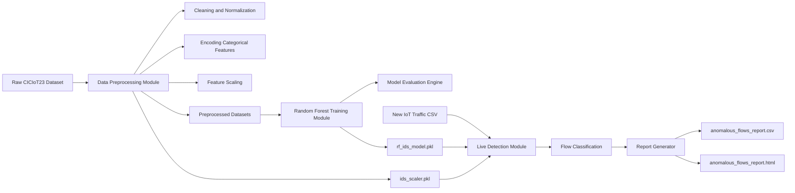

# 🔍 Anomaly Based Intrusion Detection in IoT using Random Forest (CICIoT23 Dataset)

### ⚡ A Machine Learning-based Intrusion Detection System for IoT Network Traffic

 
 
 
 

## 🧠 Overview

This project presents an **Anomaly-Based Intrusion Detection System (AIDS)** tailored for **IoT environments** using the **CICIoT23 dataset**.
It leverages a **Random Forest classifier** to distinguish between benign and malicious IoT network traffic, achieving **99.76% overall accuracy** with exceptional precision and recall.

The system automates every stage — from data preparation and training to live anomaly detection and report generation.

---

## 🧩 Dataset

**CICIoT23** is a comprehensive IoT dataset developed by the *Canadian Institute for Cybersecurity (CIC)* for network intrusion research.
It contains both **benign traffic** and multiple **IoT attack types** such as DDoS, Brute-force, and Scanning.

* **Source:** Canadian Institute for Cybersecurity
* **Data Format:** Multiple CSV files
* **Attributes:** 80+ flow-based and statistical features
* **Objective:** Classify IoT network flows as *Benign* or *Anomalous*

---

---
## ⚠️ Note
Model binaries (`.pkl` files) are not included in this repository due to GitHub file-size limitations.

To regenerate them, run the `train_ids.py` script.  
This will create:

- `rf_ids_model.pkl` — trained Random Forest IDS model  
- `ids_scaler.pkl` — scaler object used for preprocessing  
---

## ⚙️ Project Workflow

### **Phase 1 — Data Preparation**

* Merge multiple CSVs into unified datasets for training, testing, and validation.
* Clean, normalize, and encode the data.
* Output: `merged_train.csv`, `merged_test.csv`, `merged_validation.csv`.

### **Phase 2 — Model Development**

* Scale the datasets and train a **RandomForestClassifier** using scikit-learn.
* Evaluate performance using accuracy, precision, recall, F1-score, and confusion matrix.
* Output: `rf_ids_model.pkl` (model) and `ids_scaler.pkl` (scaler).

### **Phase 3 — Live Detection**

* Load the trained model and scaler to analyze new IoT traffic CSVs.
* Detect anomalous vs benign flows automatically.
* Generate reports in both CSV and HTML formats.
* Output: `anomalous_flows_report.csv` and `anomalous_flows_report.html`.

---

---
## 🔄Architechtural Diagram

---
---

## 🔄 Automated ML Workflow

---

## 📊 Model Performance

| Metric                  | Value  |
| :---------------------- | :----- |
| **Accuracy**            | 99.76% |
| **Precision (Anomaly)** | 0.9990 |
| **Recall (Anomaly)**    | 0.9985 |
| **F1-Score (Anomaly)**  | 0.9988 |
---

## 💡 Key Features

* Fully automated ML pipeline from preprocessing to prediction
* High-accuracy Random Forest classifier
* Supports new CSV-based IoT traffic analysis
* Feature importance visualization for explainability
* Modular and reusable design

---

## 🧰 Tech Stack

* **Language:** Python 3.10+
* **Libraries:** `pandas`, `numpy`, `scikit-learn`, `matplotlib`, `joblib`
* **Environment:** Kaggle / Jupyter Notebook / Local Python
* **Outputs:** `.pkl` model, metrics file, anomaly reports
---

## 🧾 Citation

If you use this dataset or reference this work, please cite:

> **Dataset:** Sharafaldin, I., Lashkari, A. H., & Ghorbani, A. A. (2023). *CICIoT2023: A realistic IoT dataset for intrusion detection research*. Canadian Institute for Cybersecurity.

---
---

## 👨‍💻 Author

**Alexander P.B.**  
*Cybersecurity Researcher & Penetration Tester*  
*Red Team & IoT Security Specialist*  

📧 *Reach out via [GitHub](https://github.com/Alexander-50) for research collaborations.*

---
